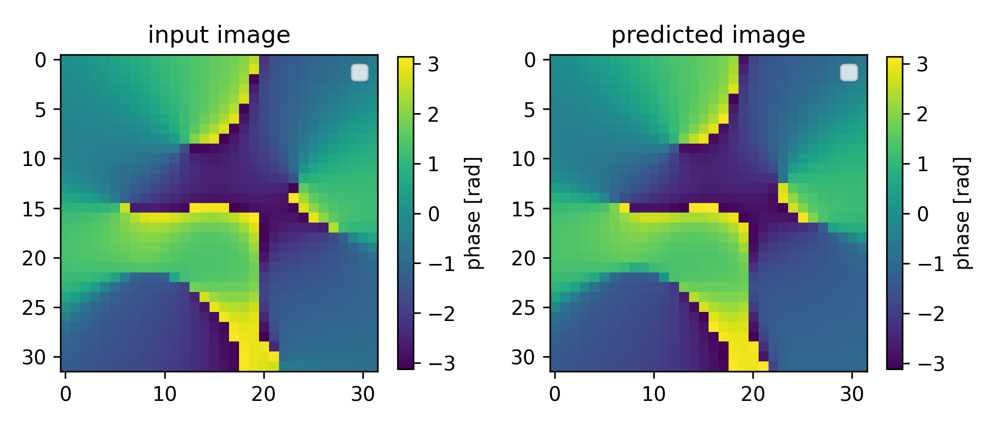
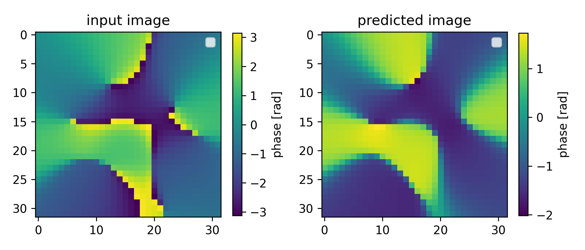

# Laguerre-Gaussian Mode Learning

This project implements deep learning models to decompose optical phase patterns into Laguerre-Gaussian (LG) mode coefficients using JAX and Keras.

## Overview

Laguerre-Gaussian modes are solutions to the paraxial wave equation with helical phase fronts, commonly used in optical physics (e.g., optical vortices, orbital angular momentum). This code:

1. **Generates synthetic datasets** of phase patterns from random LG mode superpositions
2. **Trains CNN models** to predict LG mode coefficients from phase images
3. **Implements custom JAX layers** for computing LG modes and reconstructing phase patterns
4. **Compares two architectures**:
   - Direct image-to-image reconstruction with embedded LG synthesis
   - Coefficient prediction with external reconstruction

Example reconstructions showing input phase patterns and model predictions:
The models successfully learn to decompose complex phase patterns into their constituent Laguerre-Gaussian modes and reconstruct the original images with different fidelity (no finetuning yet).

### Coefficient-Based Reconstruction
Coefficient prediction with external reconstruction. Shown image is generated using scipy.



### Phase Model Reconstruction
Direct image-to-image reconstruction with embedded LG synthesis. Predicted image is generated using jax layer.




## Key Features

- Custom `LGPhaseLayer`: Differentiable LG mode synthesis using JAX
- `JAXL2Norm`: L2 normalization layer for coefficient constraints
- Generalized Laguerre polynomial computation using explicit formulas
- Order 4 modes (15 total modes with indices satisfying 2p + |l| ≤ 4)

## Installation

### Requirements

- **Python**: 3.14+
- **JAX**: 0.4.23 with CUDA 12.2 support
- **Keras**: 3.0+ (configured to use JAX backend)
- **NumPy, SciPy, Matplotlib**: For numerical computing and visualization
- **CUDA Toolkit**: 13
- **cuDNN**: 9

### Using the Environment File (Recommended)

The `environment.yaml` file defines the full conda environment with all dependencies pinned. To create and activate the environment:

```bash
# Create the environment from the file
conda env create -f environment.yaml

# Activate it
conda activate laguerre_learning

# Verify the environment is active
conda info --envs
```

To update an existing environment if `environment.yaml` changes:

```bash
conda env update -f environment.yaml --prune
```

To export your current environment state (e.g., after adding packages):

```bash
conda env export > environment.yaml
```

To remove the environment:

```bash
conda deactivate
conda env remove -n laguerre_learning
```

### Manual Installation

If you prefer manual setup:

```bash
conda create -n laguerre_learning python=3.14
conda activate laguerre_learning
conda install -c conda-forge numpy scipy matplotlib
conda install -c nvidia cuda-toolkit=13 cudnn
pip install jax[cuda13] jaxlib keras
```

### Verify GPU Support

After installation, verify CUDA/GPU availability:

```python
import jax
print(jax.devices())  # Should show GPU devices
```

## Usage

Run the mode model script:

```bash
python mode_model.py
```


Run the main script:

```bash
python laguerre_poly.py
```

This will:

1. Generate 100k training and 10k validation samples
2. Display example phase patterns with mode compositions
3. Train two models (phase + mode model)
4. Display reconstruction examples interactively

## Model Architectures

### Phase Model (Image-to-Image)

- Encoder: 3-block CNN with average pooling
- Decoder: Dense layers → LGPhaseLayer (custom differentiable synthesis)
- Loss: MSE on predicted coefficients

### Mode Model (Pure Coefficient Prediction)

- 3-block CNN encoder with average pooling
- Global average pooling → Dense layers
- Direct coefficient prediction with L2 normalization
- Loss: MSE on predicted coefficients

## Notes

- Training uses 128-sample batches
- Default: 3 epochs (extendable via `epochs` parameter)
- Models use ELU activations throughout
- Coefficient normalization ensures unit total power (∑|c|² = 1)